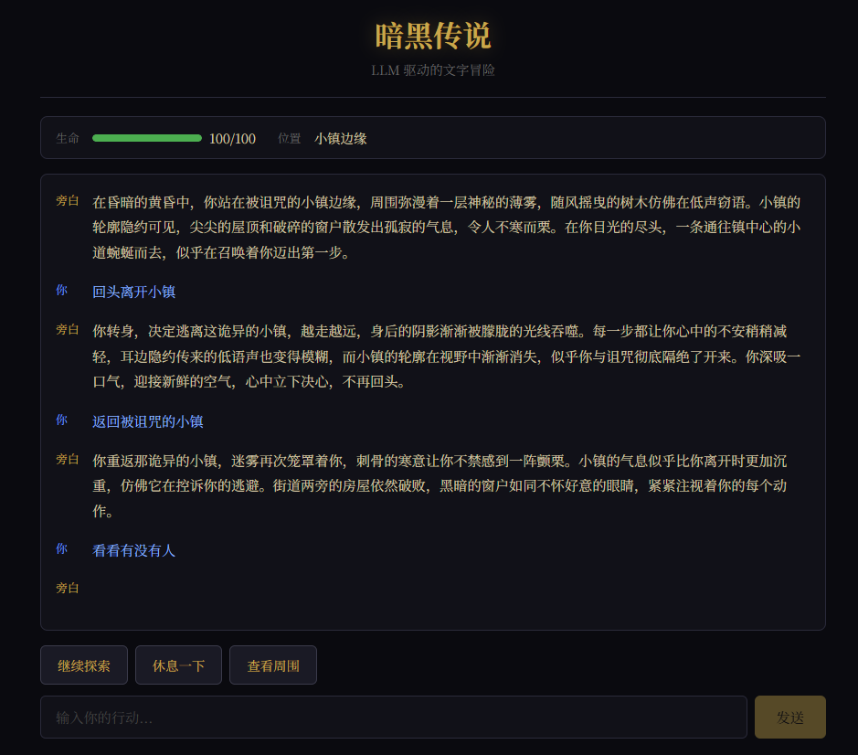

# 🏰 暗黑传说 | Dark Legend

> 基于 LLM 的网页文字冒险游戏 — 你的每一个选择，都将改写命运

一个由大语言模型驱动的沉浸式文字冒险游戏。玩家输入自由行动，AI 扮演地下城主（DM），实时生成场景描述、NPC 对话、谜题和战斗，带来独一无二的冒险体验。

## ✨ 特性

- 🎭 **AI 实时叙事** — LLM 扮演 DM，每次行动都生成独特的场景描写
- 🗡️ **自由行动** — 不局限于选项，输入任何你想做的事
- 📊 **状态追踪** — 生命值、物品栏、位置实时更新
- 🎨 **暗黑奇幻风** — 沉浸式 UI 设计，中世纪暗黑世界观
- ⚡ **流式交互** — Vue 3 + FastAPI，响应迅速

## 🖼️ 界面预览



## 🛠️ 技术栈

| 层级 | 技术 | 说明 |
|------|------|------|
| 前端 | Vue 3 + Vite + Pinia | 响应式 UI，状态管理 |
| 后端 | FastAPI + Python | 异步 API，游戏逻辑 |
| LLM | OpenAI 兼容 API | 支持 GPT / Claude / 国内代理 |
| 样式 | CSS3 暗黑主题 | 自定义字体，无外部 UI 库 |

## 🚀 快速开始

### 前置条件

- Node.js >= 18
- Python >= 3.10
- OpenAI 兼容的 API Key

### 1. 克隆项目

```bash
git clone https://github.com/Hexc01/llm-adventure.git
cd llm-adventure
```

### 2. 启动后端

```bash
cd backend
python -m venv venv
source venv/bin/activate
pip install -r requirements.txt

# 配置 API（二选一）
export OPENAI_API_KEY="your-api-key"
export OPENAI_BASE_URL="https://api.openai.com/v1"  # 或你的代理地址
export LLM_MODEL="gpt-4o-mini"                       # 或其他模型

# 启动
uvicorn main:app --reload --port 8000
```

### 3. 启动前端

```bash
cd frontend
npm install
npm run dev
```

访问 **http://localhost:5173** 开始冒险！

## 📁 项目结构

```
llm-adventure/
├── backend/
│   ├── main.py          # FastAPI 路由
│   ├── game.py          # 游戏状态管理
│   ├── llm.py           # LLM 调用封装
│   ├── models.py        # Pydantic 数据模型
│   └── requirements.txt
├── frontend/
│   ├── src/
│   │   ├── App.vue              # 主界面
│   │   ├── components/
│   │   │   ├── ChatWindow.vue   # 对话窗口
│   │   │   ├── ChoicePanel.vue  # 行动选项
│   │   │   ├── StatusBar.vue    # 状态栏
│   │   │   └── Inventory.vue    # 物品栏
│   │   ├── stores/
│   │   │   └── game.js          # Pinia 状态
│   │   └── api/
│   │       └── game.js          # API 请求
│   └── package.json
└── README.md
```

## 🔌 API 接口

| 端点 | 方法 | 说明 |
|------|------|------|
| `/api/game/new` | POST | 创建新游戏，返回初始场景 |
| `/api/game/action?session_id=xxx` | POST | 提交玩家行动 |
| `/api/game/state?session_id=xxx` | GET | 查询游戏状态 |

### 响应示例

```json
{
  "narrative": "你站在小镇边缘，四周是扭曲的树木...",
  "choices": ["走入小镇探索", "在边缘寻找藏身处", "返回森林深处"],
  "state": {
    "hp": 100,
    "max_hp": 100,
    "location": "被诅咒的小镇边缘",
    "inventory": []
  }
}
```

## 🌐 部署

### 前端 → Vercel

```bash
# 推送到 GitHub 后，在 Vercel 中导入项目
# Framework: Vite
# Build Command: npm run build
# Output Dir: dist
```

### 后端 → Railway

```bash
# 在 Railway 中导入 backend 目录
# 设置环境变量：
#   OPENAI_API_KEY = your-key
#   OPENAI_BASE_URL = your-url
# Start Command: uvicorn main:app --host 0.0.0.0 --port $PORT
```

## 📜 License

MIT
